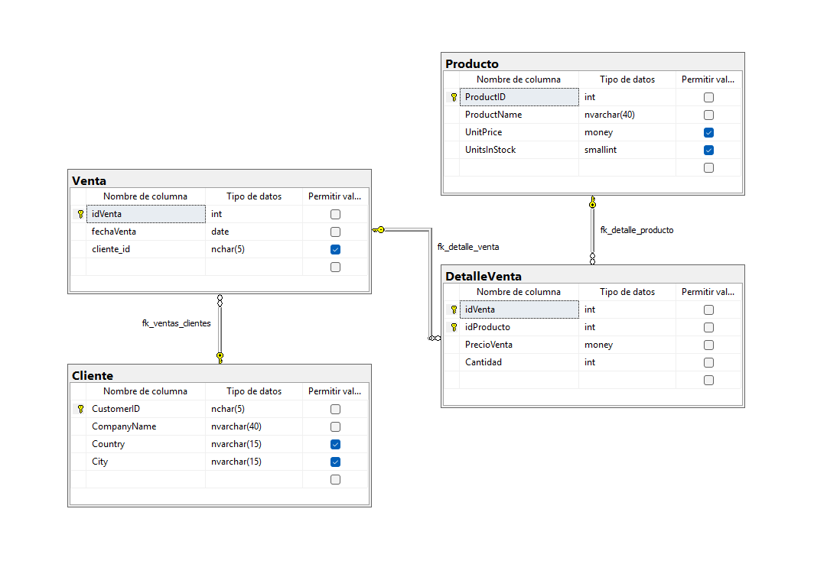

## Documentación del Store Procedure ##

## Instrucciones del Procedimiento Almacenado

Se debe crear un Store Procedure que registre una venta con múltiples productos usando un tipo de tabla (TABLE TYPE), cumpliendo con lo siguiente:

1. **Manejo de errores y transacciones**
   - Uso de TRY CATCH para controlar errores
   - Uso de BEGIN TRANSACTION, COMMIT y ROLLBACK

2. **Validaciones necesarias**
   - Validar que el cliente exista
   - Validar que sí se envíen productos
   - Validar que los productos existan
   - Validar que las cantidades sean mayores a 0
   - Validar que haya stock suficiente

3. **Inserción de venta**
   - Registrar la venta con fecha actual (GETDATE())
   - Obtener el id de la venta generada

4. **Registro del detalle**
   - Insertar múltiples productos en DetalleVenta
   - Guardar el precio actual del producto

5. **Actualización de inventario**
   - Descontar el stock según la cantidad vendida

## Explicación de Código ##

## Diagrama de Base de Datos ##



Se crea la base de datos llamada bdStoredVentas, la cual será utilizada para almacenar la información relacionada con ventas, productos y clientes. Posteriormente, se selecciona dicha base de datos con USE.

**Tabla Producto**

La tabla Producto se crea a partir de la base de datos de ejemplo Northwind, utilizando la instrucción SELECT INTO.
Se importan los siguientes campos:

1. ProductID
2. ProductName
3. UnitPrice
4. UnitsInStock

Después de su creación, se define la clave primaria (PRIMARY KEY) sobre el campo ProductID.

Esta tabla funciona como catálogo de productos.

**Tabla Cliente**

La tabla Cliente también se genera a partir de la base de datos Northwind, importando los campos:

1. CustomerID
2. CompanyName
3. Country
4. City

Luego, se establece la clave primaria sobre CustomerID.

Esta tabla funciona como catálogo de clientes.

**Tabla Venta**

La tabla Venta se crea manualmente y representa el encabezado de una venta.

Campos:

1. idVenta: clave primaria autoincremental.
2. fechaVenta: almacena la fecha en que se realiza la venta.
3. cliente_id: referencia al cliente que realiza la compra.

Se coloco una (FOREIGN KEY) que relaciona cliente_id con CustomerID de la tabla Cliente.

**Tabla DetalleVenta**

La tabla DetalleVenta almacena el detalle de cada venta

Campos:

1. idVenta: referencia a la venta.
2. idProducto: referencia al producto.
3. PrecioVenta: precio del producto al momento de la venta.
4. Cantidad: número de unidades vendidas.

Se puso una clave primaria compuesta (idVenta, idProducto)

Además, se colocaron dos llaves foráneas:

idProducto hacia la tabla Producto
idVenta hacia la tabla Venta

Esta tabla es la que lleva un historial de precios, ya que el precio se guarda en el momento de la venta.


## Código de la Tabla Type y el Store Procedure ##

```sql
CREATE TYPE type_detalle_venta AS TABLE 
(
    idProducto INT,   
    cantidad INT
);
GO
```

Se creó una tabla tipo (type) porque como ahora se va a realizar el registro de varios productos en una sola venta, se necesita enviar múltiples datos al Store Procedure en una sola ejecución, entonces una tabla tipo nos permite manejar varios registros como si fuera una tabla dentro del procedimiento. En este caso solo usabamos idProducto INT y cantidad ya que esto es lo que el usuario va a ingresar.

## Código del Store Procedure ##
```sql

CREATE OR ALTER PROCEDURE usp_registrar_ventas
@idCliente NCHAR(5),
@detalles type_detalle_venta READONLY
AS
BEGIN
    DECLARE @idVenta INT;

    BEGIN TRY

    IF NOT EXISTS (SELECT 1 FROM Cliente WHERE CustomerID = @idCliente)
    BEGIN
        THROW 50001, 'El Cliente No existe', 1;
    END

    IF NOT EXISTS (SELECT 1 FROM @detalles)
    BEGIN
        THROW 50002, 'No se recibieron productos en la venta', 1;
    END

    IF EXISTS (
        SELECT 1
        FROM @detalles AS d
        LEFT JOIN Producto AS p
        ON d.idProducto = p.ProductID
        WHERE p.ProductID IS NULL
    )
    BEGIN
        THROW 50003, 'Uno o más productos no existen', 1;
    END

    IF EXISTS (
        SELECT 1
        FROM @detalles
        WHERE cantidad <= 0
    )
    BEGIN
        THROW 50004, 'La cantidad debe ser mayor a 0', 1;
    END

    IF EXISTS (
        SELECT 1
        FROM @detalles AS d
        INNER JOIN Producto AS p
        ON d.idProducto = p.ProductID
        WHERE d.cantidad > p.UnitsInStock
    )
    BEGIN
        THROW 50005, 'No hay suficiente stock para uno o más productos', 1;
    END

    BEGIN TRANSACTION

    INSERT INTO Venta (fechaVenta, cliente_id)
    VALUES (GETDATE(), @idCliente);

    SET @idVenta = SCOPE_IDENTITY();

    INSERT INTO DetalleVenta (idVenta, idProducto, PrecioVenta, Cantidad)
    SELECT
        @idVenta,
        p.ProductID,
        p.UnitPrice,
        d.cantidad
    FROM @detalles AS d
    INNER JOIN Producto AS p
    ON d.idProducto = p.ProductID;

    UPDATE p
    SET p.UnitsInStock = p.UnitsInStock - d.cantidad
    FROM Producto AS p
    INNER JOIN @detalles AS d
    ON p.ProductID = d.idProducto;

    COMMIT;

    PRINT 'Venta hecha correctamente =)';

    END TRY
    BEGIN CATCH
        IF @@TRANCOUNT > 0
            ROLLBACK;

        PRINT 'Error: ' + ERROR_MESSAGE();
    END CATCH
END;
GO
```

Para este procedimiento almacenado se declararon 2 parámetros, porque ahora ya no se va a registrar solo un producto por venta, sino varios. Por eso se necesita identificar quién es el cliente que realiza la compra mediante @idCliente, y también se necesita recibir una tabla tipo llamada @detalles, donde vienen todos los productos con sus cantidades.

Después se declaró 1 variable, que es @idVenta, porque se necesita guardar el id de la venta en cuanto se inserta en la tabla Venta, para luego usar ese mismo id al momento de insertar todos los registros en DetalleVenta.

Dentro del sp se agregaron las siguientes validaciones

```sql
IF NOT EXISTS (SELECT 1 FROM Cliente WHERE CustomerID = @idCliente)
```

Esta validación se puso para evitar registrar una venta con un cliente que no exista en la base de datos.

```sql
IF NOT EXISTS (SELECT 1 FROM @detalles)
```

Aquí se valida que sí se hayan enviado productos dentro de la tabla tipo, porque no tendría sentido registrar una venta vacía.

```sql
IF EXISTS (
    SELECT 1
    FROM @detalles AS d
    LEFT JOIN Producto AS p
    ON d.idProducto = p.ProductID
    WHERE p.ProductID IS NULL
)
```

Esta parte sirve para revisar si alguno de los productos que llegaron en la tabla tipo no existe en la tabla Producto.
Se usa un LEFT JOIN para poder detectar los que no encuentran coincidencia.

```sql
IF EXISTS (
    SELECT 1
    FROM @detalles
    WHERE cantidad <= 0
)
```

Con esta validación se evita que se registren cantidades inválidas, como cero o números negativos.

```sql
IF EXISTS (
    SELECT 1
    FROM @detalles AS d
    INNER JOIN Producto AS p
    ON d.idProducto = p.ProductID
    WHERE d.cantidad > p.UnitsInStock
)
```

Esta validación comprueba si alguno de los productos solicitados supera el stock disponible, para evitar vender más unidades de las que realmente hay.

```sql
BEGIN TRANSACTION
```

Se usa una transacción porque la venta no es un solo paso. Aquí se inserta la venta, después el detalle, y luego se actualiza inventario. Entonces todo eso debe hacerse completo, y si algo falla, se revierte todo con ROLLBACK.

```sql
INSERT INTO Venta (fechaVenta, cliente_id)
VALUES (GETDATE(), @idCliente);
```

Aquí se registra la venta principal en la tabla Venta, guardando la fecha actual y el cliente que realizó la compra.

```sql
SET @idVenta = SCOPE_IDENTITY();
```

Esto sirve para obtener el id de la venta que se acaba de insertar, ya que ese id será ocupara para relacionar todos los productos en la tabla de DetalleVenta.

```sql
INSERT INTO DetalleVenta (idVenta, idProducto, PrecioVenta, Cantidad)
SELECT
    @idVenta,
    p.ProductID,
    p.UnitPrice,
    d.cantidad
FROM @detalles AS d
INNER JOIN Producto AS p
ON d.idProducto = p.ProductID;
```

Aquí se insertan todos los productos de la venta en DetalleVenta.
Se usa un SELECT en lugar de VALUES porque ahora ya no es un solo producto, sino varios registros que vienen dentro de @detalles.

También aquí se guarda el UnitPrice actual del producto como PrecioVenta, lo cual es importante para conservar el historial del precio aunque luego cambie en la tabla Producto.

```sql
UPDATE p
SET p.UnitsInStock = p.UnitsInStock - d.cantidad
FROM Producto AS p
INNER JOIN @detalles AS d
ON p.ProductID = d.idProducto;
```

Esta parte actualiza el inventario descontando del stock la cantidad vendida de cada producto.

```sql
COMMIT;
```

El COMMIT confirma todos los cambios si todo salió bien, o sea que la venta, el detalle y la actualización de inventario se guardan de manera correcta.

## Manejo de errores ##

```sql
BEGIN CATCH
```

Este bloque captura cualquier error que ocurra durante la ejecución del procedimiento.

```sql
IF @@TRANCOUNT > 0
    ROLLBACK;

PRINT 'Error: ' + ERROR_MESSAGE();
```

Primero se revisa si hay una transacción activa. Si sí la hay, se ejecuta ROLLBACK para deshacer todos los cambios y evitar que la base de datos quede con información incompleta.
Después se muestra el mensaje del error para saber qué fue lo que falló.